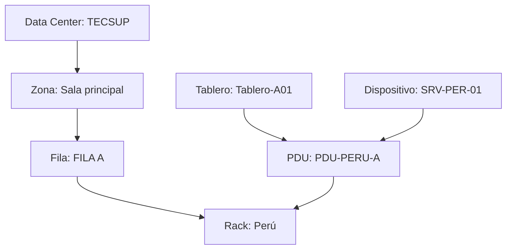

# Guía Maestra de Gestión de Infraestructura (OpenDCIM)

## 1. Topología Jerárquica y Lógica
Para que el sistema funcione, cada objeto debe estar "anidado" correctamente. El orden de creación debe ser estricto para evitar errores de referencia.

---

## 2. Fase de Configuración Base (Infraestructura)
El objetivo es recrear el espacio físico en el software.

1.  **Data Center (`Infrastructure Management > Edit Data Centers`):** Nombre único (Ej: *TECSUP*). Define aquí la dirección si es necesario.
2.  **Zona (`Edit Zones`):** Segmenta el DC en áreas lógicas (Ej: *Sala principal*). Permite reportes filtrados.
3.  **Fila (`Edit Rows of Cabinets`):** Define el alineamiento. Un rack siempre debe pertenecer a una fila para facilitar la gestión térmica.
4.  **Gabinete/Rack (`Edit Cabinets`):**
    *   **Nombre:** Mantén una nomenclatura lógica (Ej: *TECSUP-A01*).
    *   **Altura (U):** Fundamental poner la capacidad real (Ej: 42).
    *   **Carga:** Define *Maximum kW* y *Maximum Weight* para recibir alertas de sobrecarga.

---

## 3. Fase de Estandarización (Templates)
El éxito de openDCIM radica en evitar la entrada manual de datos.

*   **Manufacturers:** Registra marcas (Dell, HP, APC, etc.).
*   **Device Templates (`Template Management > Device Templates`):**
    *   **Para Servidores:**
        *   *Height:* Unidades U (Ej: 2).
        *   *Wattage:* Consumo típico bajo carga. **Vital para métricas.**
        *   *Power Connections:* Número de fuentes (Ej: 2).
    *   **Para PDUs (CDUs):**
        *   *Device Type:* **CDU**.
        *   *Height:* **0** (Esto es obligatorio para montaje vertical).
        *   *No. Power Connections:* 1 (Generalmente).

---

## 4. Fase de Infraestructura Eléctrica
Esta fase habilita la monitorización de energía.

1.  **Power Panels (`Power Management > Edit Power Panels`):**
    *   *Number of Poles:* **42** (Es la cantidad de circuitos/breakers disponibles en el tablero).
    *   *Voltage:* 208/120 (Según tu estándar).
2.  **PDU (CDU) (`View Rack > Add CDU`):**
    *   Entra a la vista gráfica del rack y haz clic en **Add CDU**.
    *   Selecciona el *Power Panel* y un *Breaker Pole* específico del tablero. Esto crea la dependencia: si el breaker cae, la PDU se queda sin energía.

---

## 5. Fase de Despliegue de Activos (Operación diaria)
El ciclo de vida de un servidor dentro del sistema.

1.  **Instalación:** En la vista gráfica del rack, haz clic en el número de espacio (U) libre y selecciona **Add Device**.
2.  **Vinculación Eléctrica:**
    *   Entra al dispositivo recién creado.
    *   Ve a **Power Connections**.
    *   Haz clic en el icono del enchufe rojo (o el que indique no conectado).
    *   Asigna la PDU (*PDU-PERU-A*) a cada fuente de poder disponible.
3.  **Estado:** Cambia el estatus de **Reserved** a **Active**.
    *   *Nota:* Solo los dispositivos "Active" cuentan para el consumo energético en el Dashboard.

---

## 6. Detalles Críticos para el Experto (Checklist)

*   **Consistencia de Datos:** Si el dashboard muestra `0 kW` de consumo, verifica:
    *   ¿El servidor está en estado `Active`?
    *   ¿Tiene el campo `Wattage` lleno en su plantilla?
    *   ¿Está conectado a una PDU que a su vez esté conectada a un Panel?
*   **Escalabilidad:** Si añades una nueva hilera de servidores, no intentes crear cada uno. Registra primero el modelo en *Device Templates* y usa la función de instalación masiva si está disponible en tu versión.
*   **Auditoría:** Utiliza el botón **Audit Report** en cada rack una vez al mes. Esto te permite imprimir una lista física y verificar si lo que dice openDCIM coincide con la realidad de TECSUP.
*   **SNMP:** Si tus PDUs son gestionables, el campo *Managed* en la plantilla de la CDU es el siguiente nivel. Introducir los OIDs permite que openDCIM lea el consumo real cada 5 minutos en lugar de usar el estimado.

