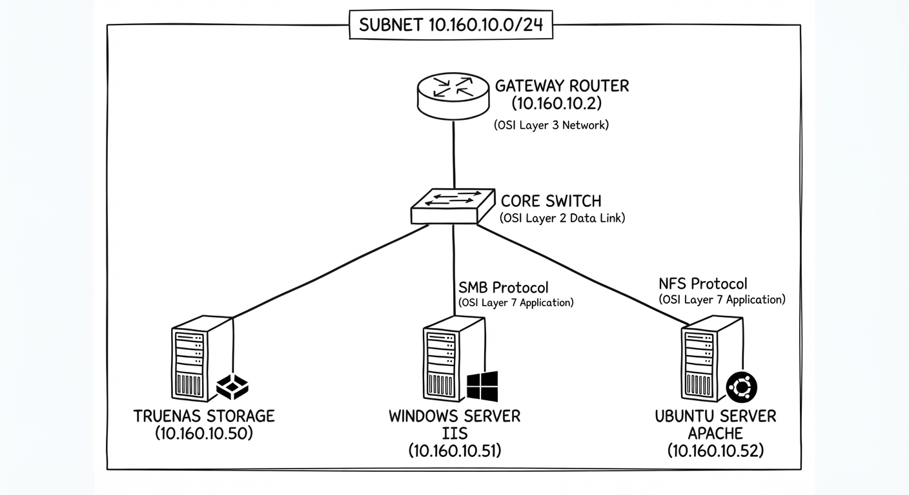
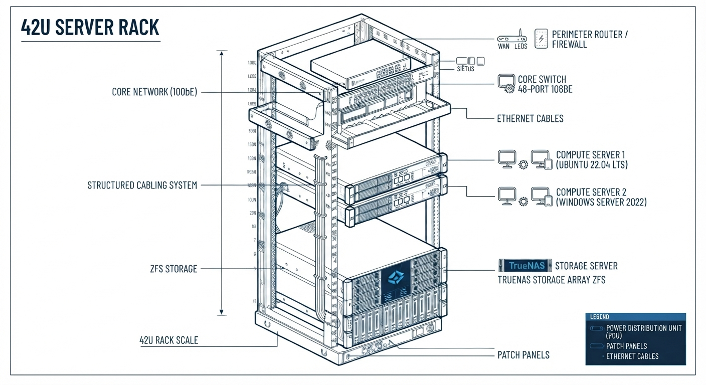

# GUÍA DE LABORATORIO N° 04: Despliegue de Servidores Web Heterogéneos con Almacenamiento Centralizado en TrueNAS (RAID 1 y RAID 5)

*   **Carrera:** Administración de Redes y Comunicaciones
*   **Curso:** Arquitectura de Servidores
*   **Duración:** 100 minutos 
*   **Credenciales del Laboratorio:**
    *   **TrueNAS:** Usuario `truenas_admin` | Password: `Tecsup00`
    *   **Windows Server:** Usuario `Administrator` | Password: `Tecsup00`
    *   **Ubuntu Server:** Usuario `sysadmin` (o tu usuario local) | Password: `Tecsup00`

---

## 1. Diseño de Topologías de Red (Infraestructura de Centro de Datos)

### A. Topología Lógica (Esquema de Red y Servicios)
La red de laboratorio opera bajo el segmento lógico corporativo `10.160.10.0/24`. Los servidores virtuales interactúan mediante protocolos estandarizados de red y almacenamiento:
*   **Gateway / Enrutamiento Perimetral:** `10.160.10.2` (Proporciona salida a Internet y enrutamiento inter-VLAN si aplica).
*   **Capa de Almacenamiento (NAS):** TrueNAS (`10.160.10.50`) centraliza los datos usando pools de OpenZFS.
*   **Capa de Cómputo / Servidores Web:** 
    *   `SRV-WEB-WIN` (`10.160.10.51`) consume almacenamiento mediante el protocolo **SMB** (Puerto TCP 445).
    *   `SRV-WEB-LNX` (`10.160.10.52`) consume almacenamiento mediante el protocolo **NFS** (Puertos TCP/UDP 2049).




---

### B. Topología Física (Infraestructura de Rack y Cableado)
Para simular un entorno de Centro de Datos real, la infraestructura física se despliega dentro de un **Gabinete Rack de 42U estándar**, utilizando hardware dedicado y virtualizado:

*   **Distribución en el Rack de 42U:**
    *   *RU 40 - 42:* Bandeja de gestión de cableado superior (Cable Management).
    *   *RU 35 - 39:* **Router Perimetral de Borde** (Cisco o similar) - 1U.
    *   *RU 30 - 34:* **Switch Core de Capa 2/3** (Gestionable de 24 puertos Gigabit) - 1U.
    *   *RU 20 - 29:* **Servidor de Almacenamiento (TrueNAS Hardware / Nodo Físico o Host ESXi)** - 2U a 4U. (Contiene el disco de SO y los 5 discos de 100GB).
    *   *RU 10 - 19:* **Servidores de Cómputo (Hosts de Virtualización VMware ESXi)** que alojan las VMs de Windows Server y Ubuntu Server - 2U.
    *   *RU 01 - 09:* PDU (Unidad de Distribución de Energía) principal y espacio libre para expansión.
*   **Esquema de Cableado Estructurado:**
    *   **Patch Cords de Red (UTP Cat 6):** 
        *   Desde las tarjetas de red físicas de los servidores (TrueNAS, Host ESXi) hacia los puertos frontales del **Switch Core**.
        *   Desde el **Switch Core** hacia el **Router Perimetral** (Enlace Uplink).
    *   **Alimentación (Power):** Cables de poder IEC desde las fuentes redundantes de los servidores y equipos de red hacia las PDU's del Rack 42U.



---

## 2. Topología de Red y Arquitectura de Discos

*   **Segmento de Red:** `10.160.10.0 /24`
*   **Gateway (Puerta de Enlace):** `10.160.10.2`
*   **TrueNAS Storage:** `10.160.10.50`
*   **SRV-WEB-WIN (Windows Server 2022 - IIS):** `10.160.10.51`
*   **SRV-WEB-LNX (Ubuntu Server - Apache):** `10.160.10.52`

**Distribución de Discos en TrueNAS (Total: 6 Discos):**
*   **Disco 0:** 20 GB (Sistema Operativo TrueNAS)
*   **Discos 1 y 2 (100 GB c/u):** Configurados en **RAID 1 (Mirror)** $\rightarrow$ Backend para Windows.
*   **Discos 3, 4 y 5 (100 GB c/u):** Configurados en **RAID 5 (RAIDZ1)** $\rightarrow$ Backend para Linux.

---

## 3. Desarrollo de la Práctica (Paso a Paso)

### FASE 1: Configuración de Pools y Publicación en TrueNAS (Min 00 - 30)

1.  **Acceso a la Consola:** 
    *   Ingresa a la interfaz web de TrueNAS en `http://10.160.10.50` utilizando el usuario `truenas_admin` y la contraseña `Tecsup00`.
2.  **Creación del Pool RAID 1 (Mirror):**
    *   Ve al menú lateral: *Storage > Pools > Add Pool > Create new pool*.
    *   Asigna el nombre: `Pool-Mirror`.
    *   Selecciona los **Discos 1 y 2**, arrastralos al área de diseño y selecciona el tipo de Vdev **Mirror**. Haz clic en *Create*.
3.  **Creación del Pool RAID 5 (RAIDZ1):**
    *   Nuevamente en *Storage > Pools > Add Pool*.
    *   Asigna el nombre: `Pool-RAID5`.
    *   Selecciona los **Discos 3, 4 y 5**, selecciona el tipo de Vdev **RAIDZ1**. Haz clic en *Create*.
4.  **Creación de Datasets (Contenedores lógicos):**
    *   Haz clic en los tres puntos (`...`) al lado de `Pool-Mirror` > *Add Dataset*. Nombre: `web-win`.
    *   Haz clic en los tres puntos (`...`) al lado de `Pool-RAID5` > *Add Dataset*. Nombre: `web-lnx`.
5.  **Publicación de Protocolos (SMB y NFS):**
    *   **Para Windows (SMB):** Ve a *Sharing > Windows Shares (SMB) > Add*. Selecciona la ruta `/mnt/Pool-Mirror/web-win`. Habilita el servicio si el sistema lo solicita.
    *   **Para Linux (NFS):** Ve a *Sharing > NFS Shares (NFS) > Add*. Selecciona la ruta `/mnt/Pool-RAID5/web-lnx`. En *Networks*, escribe `10.160.10.0/24` para permitir el acceso exclusivo a nuestra red de laboratorio. Guarda y enciende el servicio NFS.

>  **Nota de Reflexión Crítica (Fase 1):**
> *¿Por qué utilizamos SMB para el entorno Windows y NFS para el entorno Linux, en lugar de estandarizar y usar un solo protocolo para ambos? Piensa en cómo cada sistema operativo gestiona nativamente los sistemas de archivos en red y el impacto de los permisos (ACLs de Windows vs. UID/GID de Linux).*

---

### FASE 2: Despliegue de Servidores Web y Montaje Externo (Min 30 - 70)

#### PARTE A: Configuración del Servidor Web Windows (`10.160.10.51`)
1.  Inicia sesión en `SRV-WEB-WIN` como `Administrator` con la contraseña `Tecsup00`.
2.  Abre el *Administrador del Servidor* > *Agregar roles y características* > Instala el rol **Servidor Web (IIS)**.
3.  Abre el Explorador de archivos y conéctate a la ruta de red de TrueNAS: `\\10.160.10.50\web-win` (autentícate usando el usuario `truenas_admin` y la contraseña `Tecsup00`).
4.  Crea un archivo de texto llamado `index.html` dentro de esa carpeta compartida con el siguiente contenido:
    ```html
    <h1>Servidor Web Windows - Almacenado en RAID 1 (TrueNAS)</h1>
    ```
5.  Abre el *Administrador de Internet Information Services (IIS)*, ve al sitio por defecto (*Default Web Site*), haz clic en **Configuración básica** (Basic Settings) y en *Ruta física* (Physical Path), apunta a la ruta de red del recurso compartido de TrueNAS (`\\10.160.10.50\web-win`).
6.  Verifica ingresando a `http://localhost` desde el propio servidor o desde otro equipo de la red.

#### PARTE B: Configuración del Servidor Web Ubuntu (`10.160.10.52`)
1.  Inicia sesión en `SRV-WEB-LNX` como tu usuario local (ej. `sysadmin`) con la contraseña `Tecsup00`.
2.  Instala Apache y el cliente NFS ejecutando en la terminal:
    ```bash
    sudo apt update && sudo apt install apache2 nfs-common -y
    ```
3.  Crea un directorio local que servirá como punto de montaje:
    ```bash
    sudo mkdir -p /mnt/truenas-web
    ```
4.  Monta la exportación NFS proveniente de TrueNAS de forma manual para probar:
    ```bash
    sudo mount -t nfs 10.160.10.50:/mnt/Pool-RAID5/web-lnx /mnt/truenas-web
    ```
5.  Modifica el archivo de configuración de Apache para cambiar la ruta raíz del sitio web (`DocumentRoot`):
    ```bash
    sudo nano /etc/apache2/sites-available/000-default.conf
    ```
    *(Busca la línea `DocumentRoot /var/www/html` y cámbiala por `DocumentRoot /mnt/truenas-web`)*. Guarda el archivo (`Ctrl+O`, `Enter`, `Ctrl+X`).
6.  Reinicia Apache: `sudo systemctl restart apache2`.
7.  Crea un archivo de prueba en el punto montado:
    ```bash
    echo "<h1>Servidor Web Ubuntu - Almacenado en RAID 5 (TrueNAS)</h1>" | sudo tee /mnt/truenas-web/index.html
    ```
8.  Verifica ingresando a `http://10.160.10.52` desde tu navegador.

>  **Nota de Reflexión Crítica (Fase 2):**
> *Al desacoplar el almacenamiento del servidor de cómputo (las páginas web ya no están en el disco local de la máquina virtual), ¿qué ventajas operativas obtenemos si el sistema operativo de la máquina virtual de Ubuntu sufre un fallo crítico y debe ser reinstalado desde cero?*

---

### FASE 3: Pruebas de Estrés y Simulación de Fallas en Caliente (Min 70 - 90)

1.  **Mantén abiertos los dos sitios web** en tu navegador (`http://10.160.10.51` y `http://10.160.10.52`).
2.  **Simulando fallo en RAID 1 (Windows):**
    *   Ve a la consola de VMware, edita la configuración de la máquina virtual de TrueNAS y **desconecta (Remove / Disconnect)** uno de los dos discos virtuales que forman parte del `Pool-Mirror`.
    *   Actualiza el navegador del sitio web de Windows. *¿Cargó la página?* Revisa el panel de TrueNAS en *Storage > Pools* para observar la alerta de disco degradado (`DEGRADED`).
3.  **Simulando fallo en RAID 5 (Ubuntu):**
    *   En VMware, **desconecta** uno de los tres discos virtuales que forman parte del `Pool-RAID5`.
    *   Actualiza el navegador del sitio web de Ubuntu. *¿Siguió respondiendo el servicio?* Revisa TrueNAS y analiza cómo la paridad del RAID 5 mantiene la integridad a pesar de la pérdida física de un componente.

>  **Nota de Reflexión Crítica (Fase 3):**
> *Observa el comportamiento de ambos servicios web durante la desconexión del disco. ¿Hubo pérdida de datos? ¿Por qué la redundancia a nivel de infraestructura de almacenamiento es más eficiente y segura que depender de copias de seguridad manuales diarias para mantener la continuidad del negocio (Uptime)?*

---

### FASE 4: Cierre, Limpieza y Bitácora (Min 90 - 100)

1.  Reconecta los discos en VMware y observa en TrueNAS el proceso de reconstrucción automática (*Resilver*).
2.  Presenta al docente las evidencias finales:
    *   Captura de pantalla de los dos sitios web respondiendo simultáneamente.
    *   Captura de pantalla de los Pools en TrueNAS en estado de alerta degradada tras la prueba de fallo.
3.  Cierre de sesión y apagado ordenado del laboratorio.

---

## 4. Rúbrica de Calificación (Énfasis Mayor en Conclusiones y Análisis Crítico)

| Criterio / Fase | Logrado (100%) | En Proceso (50%) | No Logrado (0%) |
| :--- | :--- | :--- | :--- |
| **Fase 1: Configuración de TrueNAS (15%)** | Configura correctamente el RAID 1, RAID 5, datasets y publica mediante SMB y NFS con autenticación correcta (`truenas_admin`). | Configura los pools pero presenta errores en la publicación de shares (SMB/NFS). | No logra configurar los pools de almacenamiento ni los servicios de red. |
| **Fase 2: Despliegue Heterogéneo (20%)** | Levanta IIS en Windows (`Administrator`) apuntando a SMB y Apache en Linux apuntando a NFS de forma exitosa. | Solo logra configurar uno de los dos servidores web con almacenamiento externo. | Los servidores web funcionan pero con contenido alojado en sus discos locales. |
| **Fase 3: Pruebas de Resiliencia (15%)** | Simula correctamente la desconexión de discos en VMware y demuestra alta disponibilidad en ambos servicios web. | Realiza la prueba de fallo pero el entorno colapsa o no sabe interpretar las alertas de TrueNAS. | No ejecuta las pruebas de estrés ni la simulación de fallos en caliente. |
| **Fase 4: Conclusiones y Pensamiento Crítico (50%) ** | **Excelente:** Responde de forma profunda, técnica y argumentada a las *Notas de Reflexión Crítica* planteadas en las fases. Explica con claridad arquitectónica la elección de protocolos (SMB vs NFS), el valor del desacoplamiento de datos y la importancia de la redundancia frente al uptime de los servicios. | **Parcial:** Responde a las reflexiones de forma superficial, limitándose a repetir conceptos teóricos sin aplicarlos al escenario práctico ejecutado. | **Deficiente:** No presenta respuestas a las notas de reflexión crítica o estas carecen de sustento técnico. |
